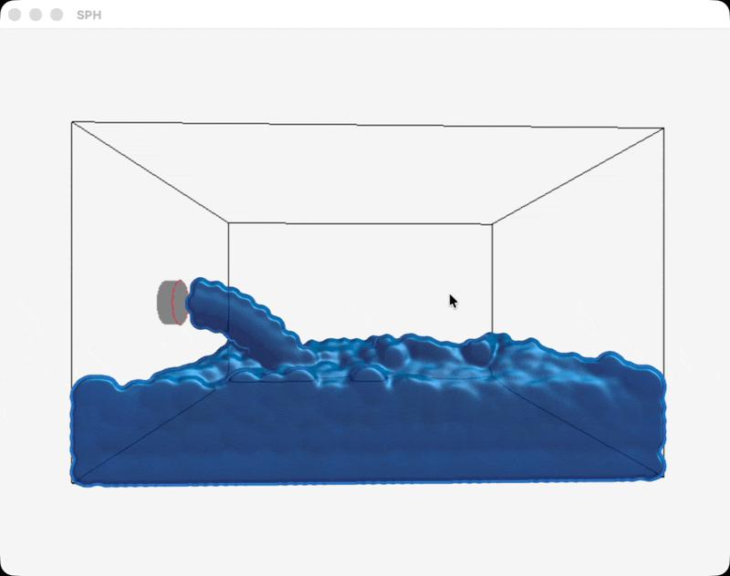

# 3D SPH Fluid Simulation

A real-time 3D liquid simulation written in C++ using [raylib](https://www.raylib.com/).

Particles are emitted from a circular pipe opening into a container. Their motion is calculated on the CPU using Smoothed Particle Hydrodynamics (SPH), while a screen-space rendering pipeline blends the particles into a smoother liquid surface.

This is an educational 3D SPH demonstration, not a validated engineering pipe-flow or CFD solver.

## Demo



## Features

- Circular disk particle emitter
- Gravity and axis-aligned container collisions
- Fixed-timestep physics simulation
- Custom 3D vector mathematics
- 3D SPH density estimation
- Pressure and viscosity forces
- Uniform spatial grid
- Search across 27 neighboring grid cells
- Configurable limit of approximately 5,000 particles
- Instanced particle rendering
- Screen-space fluid surface reconstruction
- Density and pressure visualization modes
- Physics and rendering performance diagnostics

## Simulation Pipeline

Each physics step performs the following operations:

1. Emit new particles from the pipe opening.
2. Rebuild the spatial grid.
3. Estimate particle density.
4. Calculate pressure from density.
5. Calculate pressure and viscosity accelerations.
6. Integrate velocity and position.
7. Resolve collisions against the container.

The spatial grid avoids testing every particle against every other particle. Each particle only examines nearby buckets and then rejects candidates outside the smoothing radius.

## SPH Model

Density is estimated from neighboring particle masses:

$$
\rho_i = \sum_j m_j W(\lVert x_i-x_j\rVert, h)
$$

Pressure is calculated from the difference between the measured density and rest density:

$$
p_i = k \max(\rho_i - \rho_0, 0)
$$

The simulation uses three-dimensional versions of:

- Poly6 density kernel
- Spiky pressure-gradient kernel
- Viscosity Laplacian kernel

Important simulation parameters include:

- Particle mass
- Particle spacing
- Particle radius
- Smoothing radius
- Rest density
- Pressure stiffness
- Viscosity strength
- Fixed timestep
- Emitter velocity and interval

## Rendering

Two rendering modes are available:

- Instanced spheres for inspecting individual particles
- Screen-space fluid rendering for a smoother connected surface

The screen-space path:

1. Renders particle depth.
2. Smooths the depth field.
3. Reconstructs surface normals.
4. Shades the reconstructed fluid surface.

Density and pressure color modes are also available for debugging the simulation rather than judging its final appearance.

## Requirements

- A C++17-compatible compiler
- raylib
- `pkg-config`

On macOS with Homebrew:

```bash
brew install raylib pkg-config
```

## Build

Clone the repository:

```bash
git clone https://github.com/Nick-Graves12/3D_SPH.git
cd 3D_SPH
```

Debug build:

```bash
g++ -std=c++17 -Wall -Wextra -pedantic *.cpp -o main $(pkg-config --cflags --libs raylib)
```

Optimized build:

```bash
g++ -std=c++17 -O3 -DNDEBUG *.cpp -o main $(pkg-config --cflags --libs raylib)
```

Run the program from the project directory so its shader files can be found:

```bash
./main
```

## Project Structure

```text
main.cpp                 Application setup and main loop
FluidSimulation.h/.cpp   Particle emission and SPH physics
SPHKernels.h/.cpp        Three-dimensional SPH kernels
Rendering.h/.cpp         Particle and screen-space fluid rendering
Vec3.h                    Custom 3D vector type
StartupTests.cpp          Mathematical and simulation checks
*.vs / *.fs               Vertex and fragment shaders
```

## Numerical Stability

SPH behavior depends on several coupled parameters. A result that looks plausible is not necessarily numerically stable or physically correct.

In particular:

- A smaller timestep generally improves stability.
- Particle spacing should be chosen relative to the smoothing radius.
- Excessive stiffness can create large pressure accelerations.
- Too little viscosity allows noisy relative motion.
- Too much viscosity suppresses visible fluid motion.
- The average density ratio should remain reasonably close to `1.0`.
- Rendering radius changes appearance but should not be treated as a substitute for correcting the physics.

## Current Limitations

- CPU-only simulation
- Axis-aligned rectangular container
- No simulation inside the pipe
- The pipe is represented only by a circular disk emitter
- Simplified boundary collision model
- No engineering validation
- Screen-space rendering is an approximation of the fluid surface

## Possible Future Work

- Improved boundary-particle handling
- Surface tension
- Interactive parameter controls
- Additional emitters and obstacles
- Parallel CPU force evaluation
- GPU simulation
- More advanced fluid shading, reflections, and refraction

